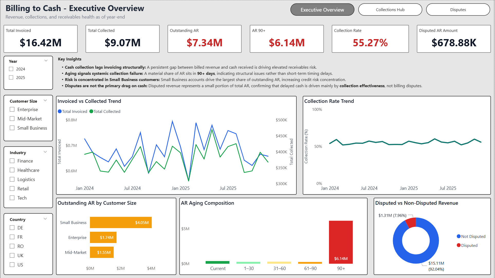

**## Dashboard Preview**



---


# Billing to Cash – End-to-End BI Project


Finance-focused Business Intelligence project analyzing the **Billing-to-Cash lifecycle**, from invoicing through collections and disputes, using Power BI and DAX.


**Time Period:** January 2024 - December 2025
**Currency:** USD  
**Tools:** Power BI, DAX  
**Domain:** Finance Analytics, Accounts Receivable, Order-to-Cash  
**Data:** Synthetic (modeled to reflect realistic billing, payment delays, aging, and disputes)

---

## Project Objective

Evaluate the effectiveness of the Billing-to-Cash process by:

- Comparing invoiced revenue vs cash collected
- Assessing outstanding AR, overdue AR, and AR 90+ risk
- Identifying customer concentration and segment-level exposure
- Analyzing disputes as blockers to cash collection
- Distinguishing collection effectiveness issues from billing/dispute drivers

---

## How to Review This Project (Recommended Order)

### 1. Dashboard Snapshots (Quick Visual Overview)

📁 `powerbi/screenshots/`

Static previews of each dashboard page:

- Executive Overview
- Collections Workbench
- Disputes & Root Causes

Provides quick context on layout and analytical scope.

---

### 2. Executive Dashboard (PDF Export)

📁 `powerbi/Billing_to_Cash.pdf`

Read-only export of the Power BI report, including:

- Invoiced vs Collected revenue
- Outstanding AR, Overdue AR, and AR 90+
- Collection rate and aging composition
- Customer concentration analysis
- Dispute impact and root cause diagnostics

Designed for executive-level review.

---

### 3. Executive Written Summary

📁 `docs/Billing_to_Cash_Executive_Summary.pdf`

One-page executive summary covering:

- Structural cash collection gaps
- AR aging risk and concentration
- Disputes impact vs collections effectiveness
- Key findings supported by visual evidence
- Action-oriented recommendations

Demonstrates business reasoning beyond dashboard visuals.

---


### 4. Power BI Report (Technical Implementation)

📁 `powerbi/Billing_to_Cash.pbix`

Includes:

- Star-schema data model
- Fact and dimension separation
- Time-aware DAX measures
- AR aging logic (Current, Overdue, 90+)
- Executive-focused KPI and visual design

Intended for technical and BI review.

---

### 5. Data & Modeling Documentation

📁 `data_raw/`  
📁 `data_model/`

Includes:

- Raw synthetic datasets (invoices, payments, disputes, customers, dates)
- KPI definitions
- Data dictionary
- Executive narrative and assumptions

All transformations and calculations are performed in Power BI.

---

## Project Structure

``` 

Billing_to_Cash_End_to_End/

│
├── README.md
│
├── data_raw/
│ ├── DimCustomer.csv
│ ├── DimDate.csv
│ ├── FactDisputes.csv
│ ├── FactInvoices.csv
│ └── FactPayments.csv
│
├── data_model/
│ ├── 01_kpi_definitions.md
│ ├── 02_data_dictionary.md
│ └── 03_executive_story.md
│
├── powerbi/
│ ├── Billing_to_Cash.pbix
│ ├── Billing_to_Cash.pdf
│ └── screenshots/
│ ├── 01_Executive_Summary.png
│ ├── 02_Collections_Workbench.png
│ └── 03_Disputes.png
│
└── docs/
└── Billing_to_Cash_Executive_Summary.pdf

``` 

---

## Skills Demonstrated

- End-to-end Order-to-Cash analysis  
- Accounts Receivable and aging risk analytics  
- Finance KPI design and validation  
- Dispute impact and root cause analysis  
- Power BI data modeling and DAX  
- Executive-level data storytelling  

---

## Notes

- All data is synthetic and created for portfolio demonstration.
- Scenarios reflect realistic billing, payment delays, aging behavior, and disputes.
- Dispute resolution speed (days to resolve) is not measured due to the absence of a resolution date.
- Metrics and insights are intentionally constrained to avoid misleading conclusions.
-Dispute Resolution Rate is defined as resolved disputes relative to current open disputes, reflecting closure throughput rather than total dispute volume.


